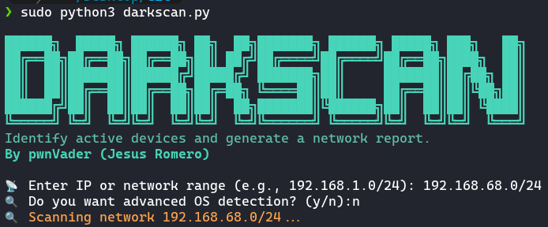

# 🔍 DarkScanner 

Bienvenido a **DarkScanner**, una herramienta para detectar dispositivos activos en una red y generar un reporte de manera sencilla de tu red. 🚀  
Desarrollada por **pwnVader (Jesus Romero)**, esta utilidad usa **Nmap** para realizar escaneos rápidos y generar reportes detallados.



---

## 🎯 Características
✅ **Escaneo Rápido:** Detecta dispositivos activos en la red en segundos.  
✅ **Detección Avanzada:** Obtiene detalles como **MAC Address, tipo de dispositivo y sistema operativo**.  
✅ **Optimizado:** Usa `--min-rate` y `--max-rtt-timeout` para mejorar la velocidad del escaneo.  
✅ **Reporte Automático:** Guarda los resultados en un archivo `.txt` con timestamp.  
✅ **Manejo de Interrupciones:** Si el usuario presiona `CTRL+C`, se guarda un **reporte parcial**.  

---

## 🛠️ Instalación

Este script requiere `python3` y `nmap`. Para instalar los paquetes necesarios:

```bash
sudo apt update && sudo apt install -y nmap python3-pip
pip3 install termcolor

